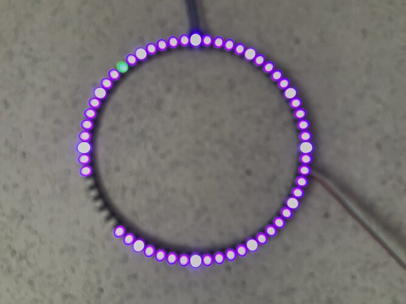

# ESP MQTT NeoPixel Clock

NodeMCU with a 60 LED WS2812 Ring showing a clock.
Brightness and On/Off Status can be controlled via MQTT respecting [MQTT-Smarthome](https://github.com/mqtt-smarthome/mqtt-smarthome).

The hue does show the current hour:
- 0° (red) is 0:00, 6:00, 12:00 or 18:00
- 120° (green) is 2:00, 8:00, 14:00 or 20:00
- 240° (blue) is 4:00, 10:00, 16:00 or 22:00

That way you can quickly assume the time by color.

Minutes are the gap in the circle.
The gap works exactly like normal clock hands.
(Top is :00, Right is 0:15 and so on.)

Seconds are the little dot with the complementary color of the rest and works in the same manner as clock hands.

It is hard to photograph the pixel ring due to its bright nature with high contrast.
The photo was taken with wrong focus in order to simplify seeing what's going on.

The basic ring is in a purple color, which indicates we are between blue and red.
As it is bright outside we can assume around 11:00.

The minute gap is centered at :40, which indicates 10:40.
(You can see the :35 and :45 hourly ticks and the gap is exactly centered.)
The complementary color dot is in the upper left corner at :53.

So the time shown is 10:40:53.
At first this takes a bit of time to read the clock.
This gets fairly simple when being used to it.
